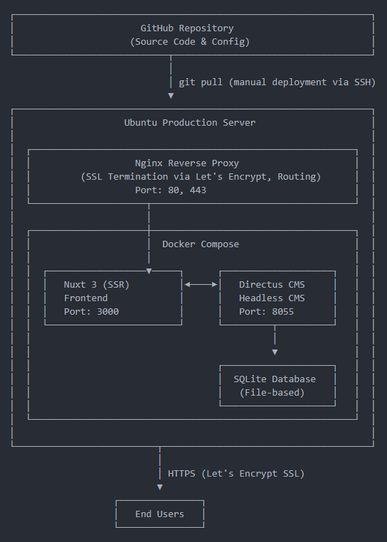

# My Little Fullstack Full Throttle

A comprehensive guide about how to set up kmapper GmbH's little full stack.

This quide starts with setting up a local development environment first. Later it shows how to set up the productive environment as well as how to continue development once a project is live.



## Initial Setup for Local Development

### 1. Repository

1. Create a project repository
1. cd into the repository
1. Add an empty Readme with `touch README.md`

1. .... ADD THINGS FOR FULL STACK TO THE README (MAYBE SEE KMAPPER.CH)

### 2. Docker

1. Add a Docker Compose file for local development with `touch docker-compose.yml`
1. Check https://hub.docker.com/r/directus/directus for the latest Directus major release
1. Add the latest major release to this repository's `docker-compose.yml` and copy its content to the newly created `docker-compose.yml`
1. Add an env file with `touch .env`
1. Copy paste this repository's `env.example` file contents to the newly created `.env` and add your secrets (use `A-Z`, `0-9`, and `_` only)
1. Add the mounted Directus directories with `mkdir -p directus/database directus/uploads directus/extensions`
1. Set the owner of the Directus directories to UID 1000 (the Directus Docker user, usually the same as your local user), with `sudo chown -R 1000:1000 directus/`
1. Set the permissions of the Directus directories so that everyone can read, with `sudo chmod -R 755 directus/`

### 3. Nuxt

1. Create a fresh SSR Nuxt project called 'frontend' with `npx nuxi init frontend`
   - Minimal setup
   - npm
   - No git repository (here)
   - No modules
1. cd into `frontend`
1. ```bash
   npm install
   npm install @css-render/vue3-ssr # To handle SSR
   npm install --save-dev @types/node # Less warnings in VSC
   npm install @directus/sdk # To communicate with Directus
   npm install @directus/visual-editing # To enable the visual editor in Directus
   npm install @nuxtjs/i18n # Default Nuxt i18n support
   npm install -D naive-ui # NaiveUI
   ```
1. ADD /frontend BASICS FROM /frontend.example !!!

### 4. Git

1. cd back into the project repository
1. Check the .gitignore

   ```git
   # Environment
   .env
   .env.prod
   .env.local
   .env.*.local

   # Directus
   directus/database/*.db
   directus/uploads/

   # Nuxt
   frontend/node_modules/
   frontend/.nuxt/
   frontend/.output/
   frontend/dist/

   # IDE
   .vscode/
   .idea/

   # Nginx
   nginx/

   # OS
   .DS_Store
   ```

1. Add a proper Git repository with:
   ```git
   git init
   git add .gitignore
   git add .
   git commit -m "Initial commit"
   ```

## Local Development0

1. cd into the project repository
1. Start everything up with `docker compose up -d`
   - Vist http://localhost:8055 for Directus, log in with the credentials from your .env file
     - Set the owner in case of the first time loging in to the Directus instance
   - Visit http://localhost:3000 for the Nuxt frontent

### Directus Extensions

1. cd into `/directus/extensions`
1. Install the scaffolding tool with `pnpm dlx create-directus-extension@latest`
   - If already installed, scaffold a new extension with `npx create-directus-extension@latest`
1. Follow the instructions
1. Develop your extension
1. cd into the given extension folder
1. Build the extension with `pnpm build`
1. Restart the Docker container to pick up the extension

## Productive Deployment

###

--- Mention how themes_settings work!!
--- Export db snapshot: docker compose exec directus npx directus schema snapshot ./database/snapshot.yaml
